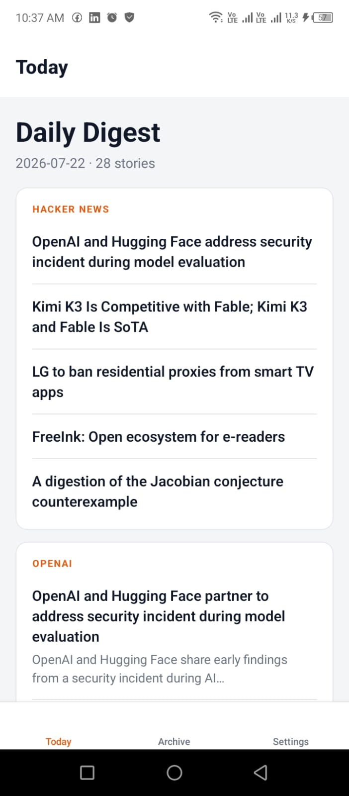
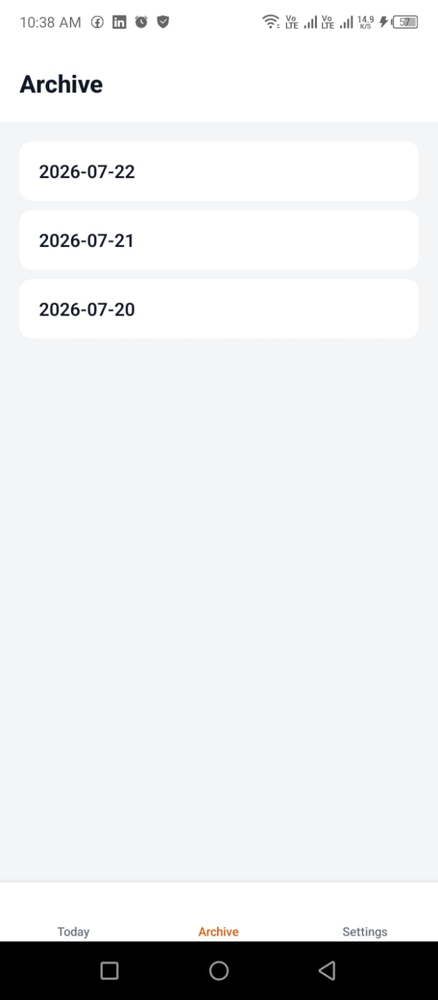
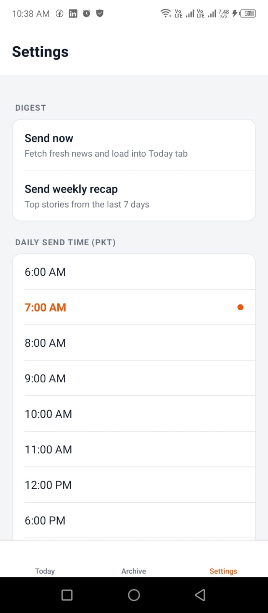

# Daily RSS Digest

A serverless news aggregator built on Cloudflare Workers. Every morning it pulls the top stories from 6 AI and tech sources, scores them by relevance, generates an AI-written intro using Llama 3.1, and fires off a clean digest to your inbox. No server, no bill, no skibidi nonsense running 24/7. Just pure edge-computed rizz delivered at whatever time you pick.

There is also a companion Android app that lets you read the digest, browse the archive, and control everything from your phone, even when your laptop is off.

---

## App Screenshots

<table>
  <tr>
    <td align="center"><b>Today</b></td>
    <td align="center"><b>Archive</b></td>
    <td align="center"><b>Settings</b></td>
  </tr>
  <tr>
    <td></td>
    <td></td>
    <td></td>
  </tr>
</table>

---

## What It Does

- Fetches RSS and Atom feeds from OpenAI, The Verge, TechCrunch, Hacker News, r/artificial, and Ars Technica
- Scores every article by keyword relevance so the most important stuff rises to the top
- Deduplicates articles across runs using Cloudflare KV so you never see the same story twice
- Generates one-liner AI summaries and a daily intro paragraph using Workers AI
- Sends the digest as a styled HTML email via Resend
- Sends a weekly recap every Sunday with the top stories from the last 7 days
- Supports pause (7 or 30 days), custom daily send time, and a full archive accessible from the app

---

## Project Layout

| File | Purpose |
| --- | --- |
| `src/index.ts` | Cron + HTTP handlers, feed orchestration, Resend delivery |
| `src/feeds.ts` | Feed list and tuning constants |
| `src/parser.ts` | RSS 2.0 / Atom to normalised articles via fast-xml-parser |
| `src/email.ts` | Inline-styled HTML and plain-text email rendering |
| `src/scoring.ts` | Keyword boost and penalty scoring |
| `src/archive.ts` | KV-backed archive storage and API |
| `src/telegram.ts` | Telegram bot delivery (optional) |

---

## Setup

```bash
npm install
npx wrangler login
```

### 1. Get a Resend API Key

1. Sign up at resend.com (free tier: 100 emails/day, 3,000/month)
2. Go to API Keys, create one with Sending access, copy the `re_...` value
3. For `FROM_EMAIL` you can use `onboarding@resend.dev` to get started instantly, or add your own domain for proper setup

### 2. Local Secrets

```bash
copy .dev.vars.example .dev.vars
```

Fill in your real key. `.dev.vars` is gitignored and never committed.

### 3. Cloudflare Secrets

`TO_EMAIL` and `FROM_EMAIL` live in `wrangler.toml` under `[vars]`. Only the API key needs to be a secret:

```bash
npx wrangler secret put RESEND_API_KEY
```

Paste the key at the prompt. It is encrypted at rest.

### 4. Deploy

```bash
npm run deploy
```

The cron trigger registers automatically from `wrangler.toml`.

---

## Testing

```bash
npm run dev
```

- `http://localhost:8787/preview` -- renders the digest HTML without sending email
- `http://localhost:8787/run` -- fetches feeds and actually sends the email
- `http://localhost:8787/api/today` -- returns the latest digest as JSON for the mobile app

---

## Schedule

Cloudflare evaluates cron triggers in UTC. Pakistan is UTC+5 with no DST:

| Cron | Fires at (PKT) |
| --- | --- |
| `0 4 * * *` | 09:00 -- current default |
| `0 8 * * *` | 13:00 |

The send time can also be changed live from the Settings tab in the Android app without redeploying.

---

## Adding Feeds

Add an entry to `FEEDS` in `src/feeds.ts`:

```ts
{ name: "Simon Willison", url: "https://simonwillison.net/atom/everything/" },
```

Both RSS 2.0 and Atom work. A note on Reddit: Cloudflare Workers egress from shared datacenter IPs and Reddit rate-limits them hard. Smaller subreddits like `r/artificial` usually work fine. Larger ones like `r/technology` return HTTP 429 consistently and are commented out.

---

## Error Handling

Feeds are fetched concurrently with `Promise.allSettled` and a 10 second per-feed timeout. A feed that fails is logged and listed in a warning panel at the bottom of the email. The digest still goes out. The run only aborts without sending if every single feed fails.

---

## Cost

Runs entirely on Cloudflare's free tier. Zero dollars per month. The only thing that costs money is if you somehow manage to send more than 3,000 emails in a month on Resend, which would be genuinely impressive.
